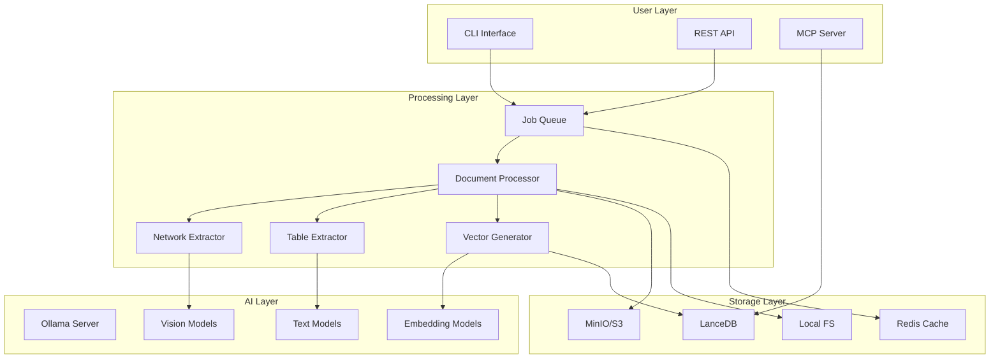
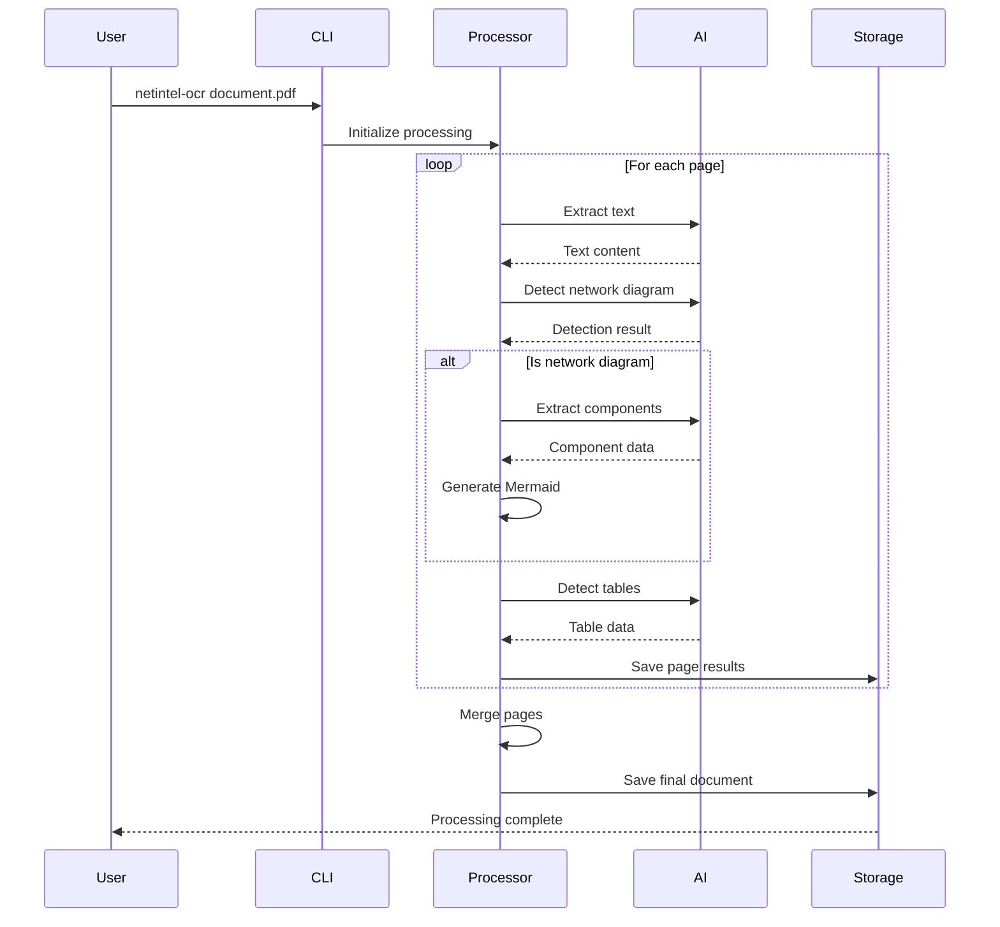

# NetIntel-OCR Architecture Guide

## Overview

NetIntel-OCR is a sophisticated document intelligence platform that combines AI-powered extraction with enterprise-grade architecture. This guide provides a comprehensive understanding of the system's architecture, components, and design principles.

## Table of Contents

1. [System Architecture](#system-architecture)
2. [Core Components](#core-components)
3. [Processing Pipeline](#processing-pipeline)
4. [Data Flow Architecture](#data-flow-architecture)
5. [Service Architecture](#service-architecture)
6. [Storage Architecture](#storage-architecture)
7. [Security Architecture](#security-architecture)
8. [Scalability Design](#scalability-design)
9. [Integration Architecture](#integration-architecture)

## System Architecture

### High-Level Architecture

```
┌─────────────────────────────────────────────────────────────────────┐
│                        External Interfaces                           │
├─────────────────────────────────────────────────────────────────────┤
│   CLI │ REST API │ MCP Server │ Web UI │ Webhooks │ Monitoring     │
└───────┴──────────┴───────────┴────────┴──────────┴─────────────────┘
                                    │
┌─────────────────────────────────────────────────────────────────────┐
│                      Service Orchestration Layer                     │
├─────────────────────────────────────────────────────────────────────┤
│                                                                      │
│  ┌──────────────┐  ┌──────────────┐  ┌──────────────┐            │
│  │ API Gateway  │  │ Load         │  │ Service      │            │
│  │              │  │ Balancer     │  │ Discovery    │            │
│  └──────────────┘  └──────────────┘  └──────────────┘            │
│                                                                      │
└──────────────────────────────────────────────────────────────────────┘
                                    │
┌─────────────────────────────────────────────────────────────────────┐
│                        Core Processing Services                      │
├─────────────────────────────────────────────────────────────────────┤
│                                                                      │
│  ┌─────────────┐  ┌─────────────┐  ┌─────────────┐  ┌──────────┐ │
│  │ Document    │  │ AI Model    │  │ Query       │  │ Batch    │ │
│  │ Processor   │  │ Service     │  │ Engine      │  │ Manager  │ │
│  └─────────────┘  └─────────────┘  └─────────────┘  └──────────┘ │
│                                                                      │
│  ┌─────────────┐  ┌─────────────┐  ┌─────────────┐  ┌──────────┐ │
│  │ Network     │  │ Table       │  │ Vector      │  │ Storage  │ │
│  │ Extractor   │  │ Extractor   │  │ Generator   │  │ Manager  │ │
│  └─────────────┘  └─────────────┘  └─────────────┘  └──────────┘ │
│                                                                      │
└──────────────────────────────────────────────────────────────────────┘
                                    │
┌─────────────────────────────────────────────────────────────────────┐
│                          Data Persistence Layer                      │
├─────────────────────────────────────────────────────────────────────┤
│                                                                      │
│  ┌─────────────┐  ┌─────────────┐  ┌─────────────┐  ┌──────────┐ │
│  │ LanceDB     │  │ Redis       │  │ MinIO/S3    │  │ Local    │ │
│  │ (Vectors)   │  │ (Queue)     │  │ (Objects)   │  │ Storage  │ │
│  └─────────────┘  └─────────────┘  └─────────────┘  └──────────┘ │
│                                                                      │
└──────────────────────────────────────────────────────────────────────┘
                                    │
┌─────────────────────────────────────────────────────────────────────┐
│                         External Dependencies                        │
├─────────────────────────────────────────────────────────────────────┤
│                                                                      │
│  ┌─────────────┐  ┌─────────────┐  ┌─────────────┐  ┌──────────┐ │
│  │ Ollama      │  │ OpenAI      │  │ HuggingFace │  │ Cloud    │ │
│  │ Server      │  │ API         │  │ Models      │  │ Services │ │
│  └─────────────┘  └─────────────┘  └─────────────┘  └──────────┘ │
│                                                                      │
└──────────────────────────────────────────────────────────────────────┘
```

### Component Interaction Diagram



## Core Components

### 1. Document Processor

The central component responsible for orchestrating PDF processing.

**Responsibilities**:
- PDF validation and parsing
- Page extraction and conversion
- Processing mode selection
- Checkpoint management
- Error handling and recovery

**Key Features**:
```python
class DocumentProcessor:
    def __init__(self):
        self.pdf_handler = PDFHandler()
        self.checkpoint_manager = CheckpointManager()
        self.output_manager = OutputManager()
    
    def process(self, pdf_path, options):
        # Validate PDF
        # Extract pages
        # Apply processing pipeline
        # Save results
        # Manage checkpoints
```

### 2. AI Model Service

Provides unified interface to multiple AI model providers.

**Architecture**:
```
┌─────────────────────────────────────┐
│         AI Model Service            │
├─────────────────────────────────────┤
│                                     │
│  Model Registry                     │
│  ├── Text Models                   │
│  ├── Vision Models                 │
│  └── Embedding Models              │
│                                     │
│  Provider Adapters                  │
│  ├── Ollama Adapter               │
│  ├── OpenAI Adapter               │
│  └── HuggingFace Adapter          │
│                                     │
│  Model Selection Engine             │
│  └── Auto-select based on task     │
│                                     │
└─────────────────────────────────────┘
```

**Model Selection Logic**:
```python
def select_model(task_type, content_type):
    if task_type == "text_extraction":
        return "nanonets-ocr-s" if simple_text else "qwen2.5vl"
    elif task_type == "network_detection":
        return "qwen2.5vl" if complex_diagram else "bakllava"
    elif task_type == "embedding":
        return "nomic-embed-text"
```

### 3. Network Diagram Extractor

Specialized module for network topology extraction.

**Processing Pipeline**:
```
Image Input → Detection → Classification → Extraction → Validation → Mermaid
     ↓            ↓            ↓              ↓            ↓           ↓
   [PNG]    [Confidence]  [Diagram Type] [Components] [Syntax]   [Output]
```

**Component Detection**:
- Routers, switches, firewalls
- Servers, databases, load balancers
- Cloud services, containers
- Connection types and protocols

### 4. Table Extractor

Hybrid table extraction with multiple methods.

**Extraction Methods**:
```python
class TableExtractor:
    def extract(self, page, method="hybrid"):
        if method == "pdfplumber":
            return self.library_extraction(page)
        elif method == "llm":
            return self.vision_extraction(page)
        elif method == "hybrid":
            tables = self.library_extraction(page)
            if not tables or low_confidence:
                tables = self.vision_extraction(page)
            return self.validate_tables(tables)
```

### 5. Vector Generator

Creates optimized vector embeddings for search.

**Chunking Strategies**:
- **Semantic**: Respects document structure
- **Fixed**: Consistent token count
- **Sentence**: Natural language boundaries

**Processing Flow**:
```
Document → Filter → Chunk → Embed → Index
    ↓        ↓       ↓       ↓       ↓
[Markdown] [Clean] [1000t] [384d] [LanceDB]
```

## Processing Pipeline

### Standard Processing Flow



### Batch Processing Architecture

```
┌─────────────────────────────────────────────────────┐
│                 Batch Controller                     │
├─────────────────────────────────────────────────────┤
│                                                      │
│  Input Scanner → Queue Manager → Worker Pool        │
│       ↓              ↓               ↓              │
│  [Find PDFs]    [Distribute]    [Process]          │
│                                                      │
│  Progress Tracker → Result Aggregator → DB Merger   │
│       ↓                  ↓                ↓         │
│  [Monitor]          [Collect]         [Centralize]  │
│                                                      │
└──────────────────────────────────────────────────────┘
```

## Data Flow Architecture

### Document Processing Data Flow

```
PDF Input
    ↓
Page Extraction ─────┬──────────────┬──────────────┐
    ↓                ↓              ↓              ↓
Text OCR      Network Detection  Table Detection  Metadata
    ↓                ↓              ↓              ↓
Markdown      Mermaid Diagram   JSON Tables    Properties
    ↓                ↓              ↓              ↓
    └────────────────┴──────────────┴──────────────┘
                            ↓
                    Content Merging
                            ↓
                    Vector Generation
                            ↓
                 ┌──────────┴──────────┐
                 ↓                     ↓
           Local Storage          Cloud Storage
                 ↓                     ↓
           LanceDB Index          S3/MinIO
```

### Query Processing Data Flow

```
User Query
    ↓
Query Parser ──→ Filter Builder ──→ Embedding Generator
    ↓                ↓                    ↓
Keywords         Conditions          Vector Representation
    ↓                ↓                    ↓
    └────────────────┴────────────────────┘
                         ↓
                  Vector Search Engine
                         ↓
                  Result Retrieval
                         ↓
                 Reranking Engine
                         ↓
                 Format Converter
                         ↓
                  Response Output
```

## Service Architecture

### Microservices Design (v0.1.13)

```
┌──────────────────────────────────────────────────────┐
│                   API Gateway                         │
│                 (Kong/Nginx/HAProxy)                  │
└────────────┬────────────────────────┬────────────────┘
             ↓                        ↓
    ┌────────────────┐       ┌────────────────┐
    │  API Service   │       │  MCP Service   │
    │   (FastAPI)    │       │   (SSE/HTTP)   │
    │                │       │                │
    │ • Upload       │       │ • Read-only    │
    │ • Process      │       │ • Streaming    │
    │ • Query        │       │ • LLM Bridge   │
    └────────┬────────┘       └────────┬────────┘
             ↓                         ↓
    ┌────────────────────────────────────────┐
    │          Message Queue (Redis)          │
    └────────────────┬────────────────────────┘
                     ↓
    ┌────────────────────────────────────────┐
    │         Worker Pool (1-N Workers)       │
    │                                         │
    │  ┌──────────┐  ┌──────────┐           │
    │  │ Worker 1 │  │ Worker 2 │  ...      │
    │  └──────────┘  └──────────┘           │
    └─────────────────────────────────────────┘
```

### Container Architecture

```yaml
services:
  api:
    image: netintel-ocr:api
    replicas: 3
    resources:
      limits:
        memory: 2Gi
        cpu: 1000m
    
  mcp:
    image: netintel-ocr:mcp
    replicas: 5
    resources:
      limits:
        memory: 1Gi
        cpu: 500m
    
  worker:
    image: netintel-ocr:worker
    replicas: 10
    resources:
      limits:
        memory: 4Gi
        cpu: 2000m
    
  redis:
    image: redis:alpine
    replicas: 2  # Master-slave
    
  minio:
    image: minio/minio
    replicas: 4  # Distributed mode
```

## Storage Architecture

### Multi-Tier Storage Design

```
┌─────────────────────────────────────────────────────┐
│                   Hot Storage                        │
│                  (Frequently Accessed)               │
├─────────────────────────────────────────────────────┤
│  • Recent documents (< 7 days)                      │
│  • Active queries                                   │
│  • Cache layer (Redis)                              │
│  • Local SSD storage                                │
└─────────────────────────────────────────────────────┘
                          ↓
┌─────────────────────────────────────────────────────┐
│                   Warm Storage                       │
│                  (Occasional Access)                 │
├─────────────────────────────────────────────────────┤
│  • Documents 7-30 days old                          │
│  • Indexed in LanceDB                               │
│  • MinIO distributed storage                        │
│  • Compressed format                                │
└─────────────────────────────────────────────────────┘
                          ↓
┌─────────────────────────────────────────────────────┐
│                   Cold Storage                       │
│                    (Archive)                         │
├─────────────────────────────────────────────────────┤
│  • Documents > 30 days                              │
│  • S3 Glacier / Archive tier                        │
│  • Compressed and deduplicated                      │
│  • Retrieval on demand                              │
└─────────────────────────────────────────────────────┘
```

### Database Schema

```sql
-- LanceDB Tables (Conceptual)

-- Documents table
CREATE TABLE documents (
    document_id TEXT PRIMARY KEY,  -- MD5 hash
    source_file TEXT,
    file_size INTEGER,
    page_count INTEGER,
    processed_at TIMESTAMP,
    metadata JSONB,
    embedding VECTOR(384)
);

-- Chunks table
CREATE TABLE chunks (
    chunk_id TEXT PRIMARY KEY,
    document_id TEXT REFERENCES documents,
    content TEXT,
    page_numbers INTEGER[],
    chunk_index INTEGER,
    embedding VECTOR(384),
    metadata JSONB
);

-- Tables table
CREATE TABLE extracted_tables (
    table_id TEXT PRIMARY KEY,
    document_id TEXT REFERENCES documents,
    page_number INTEGER,
    table_data JSONB,
    extraction_method TEXT,
    confidence FLOAT
);

-- Network diagrams table
CREATE TABLE network_diagrams (
    diagram_id TEXT PRIMARY KEY,
    document_id TEXT REFERENCES documents,
    page_number INTEGER,
    mermaid_code TEXT,
    components JSONB,
    connections JSONB,
    confidence FLOAT
);
```

## Security Architecture

### Security Layers

```
┌─────────────────────────────────────────────────────┐
│              Application Security                    │
├─────────────────────────────────────────────────────┤
│  • Input validation                                 │
│  • API authentication (JWT/OAuth)                   │
│  • Rate limiting                                    │
│  • CORS policies                                    │
└─────────────────────────────────────────────────────┘
                          ↓
┌─────────────────────────────────────────────────────┐
│              Transport Security                      │
├─────────────────────────────────────────────────────┤
│  • TLS 1.3 encryption                               │
│  • Certificate pinning                              │
│  • Mutual TLS for services                          │
└─────────────────────────────────────────────────────┘
                          ↓
┌─────────────────────────────────────────────────────┐
│               Data Security                          │
├─────────────────────────────────────────────────────┤
│  • Encryption at rest                               │
│  • Field-level encryption                           │
│  • Key management (Vault/KMS)                       │
│  • Data sanitization                                │
└─────────────────────────────────────────────────────┘
                          ↓
┌─────────────────────────────────────────────────────┐
│            Infrastructure Security                   │
├─────────────────────────────────────────────────────┤
│  • Network isolation                                │
│  • Firewall rules                                   │
│  • Container security                               │
│  • Secret management                                │
└─────────────────────────────────────────────────────┘
```

### Authentication & Authorization

```python
# API Authentication Flow
@app.post("/api/v1/auth/token")
async def login(credentials: Credentials):
    user = authenticate_user(credentials)
    access_token = create_access_token(user)
    return {"access_token": access_token, "token_type": "bearer"}

@app.get("/api/v1/documents")
@require_auth
async def get_documents(current_user: User = Depends(get_current_user)):
    # Role-based access control
    if not current_user.has_permission("read:documents"):
        raise HTTPException(403, "Insufficient permissions")
    return get_user_documents(current_user)
```

## Scalability Design

### Horizontal Scaling Strategy

```
                Load Balancer
                     ↓
        ┌────────────┼────────────┐
        ↓            ↓            ↓
    API Server   API Server   API Server
        ↓            ↓            ↓
        └────────────┼────────────┘
                     ↓
              Message Queue
                     ↓
        ┌────────────┼────────────┐
        ↓            ↓            ↓
     Worker       Worker       Worker
    (1-100)      (1-100)      (1-100)
```

### Auto-Scaling Rules

```yaml
# Kubernetes HPA Configuration
apiVersion: autoscaling/v2
kind: HorizontalPodAutoscaler
metadata:
  name: api-autoscaler
spec:
  scaleTargetRef:
    apiVersion: apps/v1
    kind: Deployment
    name: netintel-api
  minReplicas: 2
  maxReplicas: 50
  metrics:
  - type: Resource
    resource:
      name: cpu
      target:
        type: Utilization
        averageUtilization: 70
  - type: Resource
    resource:
      name: memory
      target:
        type: Utilization
        averageUtilization: 80
  behavior:
    scaleUp:
      stabilizationWindowSeconds: 60
      policies:
      - type: Percent
        value: 100  # Double pods
        periodSeconds: 60
    scaleDown:
      stabilizationWindowSeconds: 300
      policies:
      - type: Percent
        value: 50  # Halve pods
        periodSeconds: 300
```

### Performance Optimization

```python
# Caching Strategy
class CacheManager:
    def __init__(self):
        self.redis = Redis()
        self.ttl = {
            "embeddings": 3600,     # 1 hour
            "queries": 300,          # 5 minutes
            "documents": 86400,      # 24 hours
        }
    
    async def get_or_compute(self, key, compute_func, category="default"):
        # Check cache first
        cached = await self.redis.get(key)
        if cached:
            return json.loads(cached)
        
        # Compute if not cached
        result = await compute_func()
        
        # Store in cache
        ttl = self.ttl.get(category, 600)
        await self.redis.setex(key, ttl, json.dumps(result))
        
        return result
```

## Integration Architecture

### API Integration Points

```
┌─────────────────────────────────────────────────────┐
│                 External Systems                     │
├─────────────────────────────────────────────────────┤
│                                                      │
│  Document Management    Knowledge Base    SIEM      │
│  Systems (DMS)          Platforms         Systems   │
│      ↓                      ↓                ↓      │
│  ┌────────┐            ┌────────┐      ┌────────┐  │
│  │Webhooks│            │REST API│      │Syslog  │  │
│  └────────┘            └────────┘      └────────┘  │
│      ↓                      ↓                ↓      │
└──────┴──────────────────────┴────────────────┴──────┘
                             ↓
                    NetIntel-OCR Platform
```

### Event-Driven Architecture

```python
# Event definitions
events = {
    "document.uploaded": DocumentUploadedEvent,
    "document.processed": DocumentProcessedEvent,
    "diagram.extracted": DiagramExtractedEvent,
    "query.executed": QueryExecutedEvent,
    "error.occurred": ErrorOccurredEvent,
}

# Event handler
@event_handler("document.processed")
async def on_document_processed(event: DocumentProcessedEvent):
    # Trigger downstream actions
    await notify_subscribers(event)
    await update_search_index(event.document_id)
    await generate_summary(event.document_id)
```

### Webhook System

```python
class WebhookManager:
    async def trigger(self, event_type: str, payload: dict):
        webhooks = await self.get_webhooks(event_type)
        
        for webhook in webhooks:
            await self.send_webhook(
                url=webhook.url,
                payload={
                    "event": event_type,
                    "timestamp": datetime.utcnow().isoformat(),
                    "data": payload
                },
                headers=webhook.headers,
                retry_policy=webhook.retry_policy
            )
```

## Monitoring & Observability

### Metrics Collection

```python
# Prometheus metrics
from prometheus_client import Counter, Histogram, Gauge

# Define metrics
documents_processed = Counter(
    'documents_processed_total',
    'Total documents processed',
    ['status', 'type']
)

processing_duration = Histogram(
    'processing_duration_seconds',
    'Document processing duration',
    ['document_type']
)

active_workers = Gauge(
    'active_workers',
    'Number of active workers'
)

# Instrument code
@observe_processing
async def process_document(doc):
    start = time.time()
    try:
        result = await process(doc)
        documents_processed.labels('success', doc.type).inc()
        return result
    except Exception as e:
        documents_processed.labels('error', doc.type).inc()
        raise
    finally:
        duration = time.time() - start
        processing_duration.labels(doc.type).observe(duration)
```

### Distributed Tracing

```python
# OpenTelemetry integration
from opentelemetry import trace

tracer = trace.get_tracer(__name__)

@tracer.start_as_current_span("process_document")
async def process_document(document_id: str):
    span = trace.get_current_span()
    span.set_attribute("document.id", document_id)
    
    with tracer.start_as_current_span("extract_text"):
        text = await extract_text(document_id)
    
    with tracer.start_as_current_span("detect_diagrams"):
        diagrams = await detect_diagrams(document_id)
    
    with tracer.start_as_current_span("generate_vectors"):
        vectors = await generate_vectors(text)
    
    return ProcessingResult(text, diagrams, vectors)
```

## Development & Testing

### Testing Architecture

```
┌─────────────────────────────────────────────────────┐
│                   Test Pyramid                       │
├─────────────────────────────────────────────────────┤
│                                                      │
│            End-to-End Tests (10%)                   │
│                 ┌─────────┐                         │
│                 │  E2E    │                         │
│                 └─────────┘                         │
│                                                      │
│         Integration Tests (30%)                     │
│           ┌─────────────────┐                       │
│           │  Integration    │                       │
│           └─────────────────┘                       │
│                                                      │
│          Unit Tests (60%)                           │
│      ┌───────────────────────┐                      │
│      │      Unit Tests       │                      │
│      └───────────────────────┘                      │
│                                                      │
└──────────────────────────────────────────────────────┘
```

### CI/CD Pipeline

```yaml
# .github/workflows/ci.yml
name: CI/CD Pipeline

on: [push, pull_request]

jobs:
  test:
    runs-on: ubuntu-latest
    steps:
      - uses: actions/checkout@v2
      - name: Run tests
        run: |
          pytest tests/unit
          pytest tests/integration
          pytest tests/e2e
      
  build:
    needs: test
    runs-on: ubuntu-latest
    steps:
      - name: Build Docker images
        run: |
          docker build -t netintel-ocr:api ./api
          docker build -t netintel-ocr:worker ./worker
      
  deploy:
    needs: build
    if: github.ref == 'refs/heads/main'
    runs-on: ubuntu-latest
    steps:
      - name: Deploy to Kubernetes
        run: |
          helm upgrade --install netintel-ocr ./helm
```

## Best Practices

### Architecture Principles

1. **Separation of Concerns**: Each component has a single responsibility
2. **Loose Coupling**: Components communicate through well-defined interfaces
3. **High Cohesion**: Related functionality is grouped together
4. **Scalability First**: Design for horizontal scaling from the start
5. **Failure Resilience**: Implement circuit breakers and retry logic
6. **Security by Design**: Security considered at every layer

### Design Patterns

- **Repository Pattern**: Abstract data access
- **Factory Pattern**: Model and processor creation
- **Observer Pattern**: Event handling
- **Strategy Pattern**: Processing methods
- **Circuit Breaker**: External service calls
- **Retry Pattern**: Transient failure handling

### Performance Guidelines

- Cache frequently accessed data
- Implement connection pooling
- Use async/await for I/O operations
- Batch database operations
- Optimize image processing pipelines
- Implement rate limiting

## Conclusion

NetIntel-OCR's architecture is designed for scalability, reliability, and extensibility. The modular design allows for easy customization and integration while maintaining high performance and security standards. Whether deployed as a single container or distributed across a Kubernetes cluster, the architecture adapts to meet varying workload demands while maintaining consistent performance and reliability.