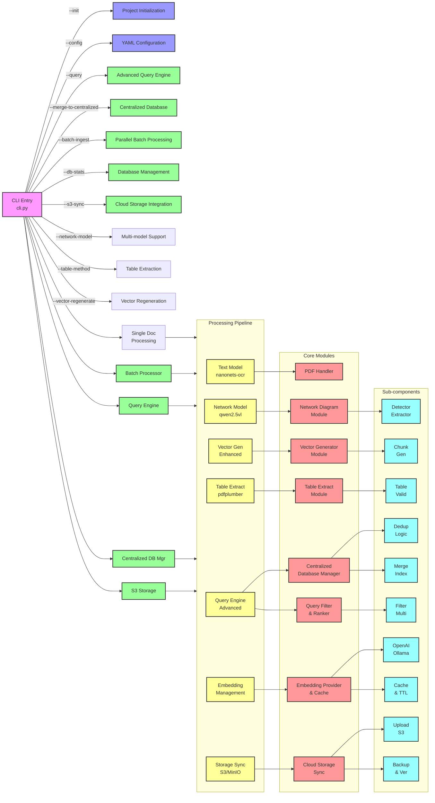

# NetIntel-OCR

**The Foundation for Building Semantic CMDBs from Your Network Documentation**

NetIntel-OCR transforms unstructured network documentation into structured knowledge, laying the groundwork for Semantic Configuration Management Databases (CMDBs). By extracting network diagrams, relationships, and configurations from PDFs, NetIntel-OCR enables organizations to build intelligent knowledge graphs that understand the complex relationships between network elements, security controls, and business services.

## 🚀 Key Features

- **Relationship Discovery**: Extracts network components and their relationships to build knowledge graphs
- **Semantic Foundation**: Converts diagrams and text into RDF-ready triples for CMDB population
- **Intelligent Extraction**: Identifies entities, connections, and dependencies from network diagrams
- **Context Preservation**: Maintains relationships between network elements, not just isolated data
- **Vector Knowledge Base**: Embeds extracted knowledge for semantic queries and impact analysis
- **100% On-Premise**: Ensures critical infrastructure knowledge never leaves your control
- **Scalable Processing**: From proof-of-concept to enterprise-wide knowledge graph building

## 📚 Documentation

- **[Quick Reference Guide](./Quick-Reference-Guide.md)** - Common commands and quick tips
- **[Deployment Guide](./Deployment-Guide.md)** - Installation and deployment options
- **[Architecture Guide](./Architecture-Guide.md)** - System design and components
- **[Use Cases](./UseCases.md)** - Real-world applications and ROI

## ⚡ Quick Start

### 5-Minute Setup

```bash
# Install NetIntel-OCR
pip install netintel-ocr

# Install Ollama (AI model server)
curl -fsSL https://ollama.com/install.sh | sh
ollama serve

# Pull required models
ollama pull nanonets-ocr-s:latest
ollama pull qwen2.5vl:latest

# Process your first PDF
netintel-ocr document.pdf
```

### Docker Setup

```bash
# Initialize with Docker support
netintel-ocr --init --deployment-scale minimal

# Start services
cd netintel-ocr/docker
docker-compose -f docker-compose.minimal.yml up

# Process documents
netintel-ocr /path/to/document.pdf
```

## 🎯 The Journey to Semantic CMDB

### Step 1: Document Intelligence (NetIntel-OCR)
- **Extract** network diagrams, configurations, and relationships from PDFs
- **Identify** network elements, security controls, and their connections
- **Structure** unstructured data into queryable formats

### Step 2: Knowledge Graph Construction
- **Generate** RDF triples from extracted relationships (Router → connects-to → Switch)
- **Map** service dependencies and impact chains
- **Build** semantic models of your infrastructure

### Step 3: Intelligent Operations
- **Query** relationships: "What services depend on Router-X?"
- **Predict** impacts: "What fails if this component goes down?"
- **Automate** root cause analysis and change impact assessments

### Real-World Impact
- **70% faster** incident resolution through relationship understanding
- **85% reduction** in change planning time with impact analysis
- **Real-time** compliance verification through semantic queries

[Explore the full journey →](./UseCases.md)

## 🏗️ Architecture

NetIntel-OCR uses a modular, microservices architecture that scales from single containers to distributed Kubernetes deployments:

### System Component Diagram



[Learn more about the architecture →](./Architecture-Guide.md)

## 📊 Deployment Options

Choose the deployment that fits your needs:

| Scale | Users | Documents/Day | Setup Time | Resources |
|-------|-------|---------------|------------|-----------|
| **Minimal** | 1-5 | <10 | 5 min | 2GB RAM |
| **Small** | 5-20 | 10-50 | 15 min | 4GB RAM |
| **Medium** | 20-100 | 50-200 | 30 min | 8GB RAM |
| **Enterprise** | 100+ | 200+ | 1 hour | 16GB+ RAM |

[View deployment guide →](./Deployment-Guide.md)

## 💡 Building Blocks for Semantic CMDB

### Relationship Extraction
- **Network Topology**: Identifies routers, switches, firewalls and their connections
- **Service Dependencies**: Maps which services rely on which infrastructure
- **Security Controls**: Understands what protects what in your network
- **Redundancy Paths**: Discovers primary and backup relationships

### Knowledge Structuring
- **Entity Recognition**: Identifies network components and their properties
- **Relationship Mapping**: Captures "connects-to", "depends-on", "protects" relationships
- **Context Preservation**: Maintains the semantic meaning of connections
- **RDF-Ready Output**: Structures data for knowledge graph generation

### Semantic Foundation
- **Vector Embeddings**: Creates semantic representations for intelligent queries
- **Graph-Ready Data**: Outputs structured for graph database ingestion
- **Relationship Queries**: Enables questions about dependencies and impacts
- **Pattern Discovery**: Identifies common architectures and configurations

## 🔧 From Documents to Knowledge

```bash
# Step 1: Extract relationships from network documentation
netintel-ocr network-architecture.pdf

# Step 2: Process multiple documents to build knowledge base
netintel-ocr --batch-ingest --input-pattern "*.pdf" --parallel 8

# Step 3: Query relationships (foundation for semantic CMDB)
netintel-ocr --query "router connections" --show-relationships

# Step 4: Export for knowledge graph construction
netintel-ocr --export-relationships --format rdf > network-graph.rdf

# Step 5: Enable semantic queries
netintel-ocr --semantic-query "impact of router CR-01 failure"
```

[See all commands →](./Quick-Reference-Guide.md)

## 📈 The Value of Semantic Intelligence

### Beyond Document Search
Traditional document management gives you searchable text. NetIntel-OCR gives you the foundation for:
- **Impact Analysis**: Understanding cascading effects of changes
- **Dependency Mapping**: Knowing what depends on what
- **Predictive Operations**: Anticipating failures before they happen
- **Automated Compliance**: Continuous verification through relationships

### Measurable Outcomes
- **70% faster** incident resolution through relationship understanding
- **85% reduction** in change impact assessment time
- **90% improvement** in root cause identification
- **Real-time** service dependency visibility

### The Semantic CMDB Advantage
| Traditional Approach | With Semantic Foundation |
|---------------------|-------------------------|
| Search for "Router-X" | "What depends on Router-X?" |
| Find documentation | Understand relationships |
| Manual analysis | Automated impact assessment |
| Static information | Living knowledge graph |

[Explore the full potential →](./UseCases.md)

## 🔒 Security & Compliance

- **100% On-Premise**: No data leaves your infrastructure
- **Air-Gap Ready**: Deployable in isolated environments
- **Audit Trails**: Complete logging of all operations
- **Encryption**: At-rest and in-transit encryption
- **RBAC**: Role-based access control (Enterprise)

## 🛠️ System Requirements

### Minimum Requirements
- **OS**: Linux, macOS, or Windows (WSL2)
- **Python**: 3.9+
- **RAM**: 2GB
- **Storage**: 10GB

### Recommended
- **OS**: Ubuntu 22.04 LTS
- **RAM**: 8GB+
- **Storage**: 50GB SSD
- **GPU**: Optional (speeds up processing)

## 🤝 Support & Community

- **Documentation**: Comprehensive guides and references
- **GitHub Issues**: Bug reports and feature requests
- **Community**: Discord/Slack channels
- **Commercial Support**: enterprise@netintel-ocr.com

## 📜 License

NetIntel-OCR is available under the [Apache 2.0 License](./LICENSE.md).

## 🚀 Your Path to Semantic CMDB

### Phase 1: Document Intelligence (Weeks 1-4)
1. **Deploy NetIntel-OCR** - Start with [Deployment Guide](./Deployment-Guide.md)
2. **Process existing documentation** - Extract network diagrams and configurations
3. **Build searchable repository** - Create your initial knowledge base

### Phase 2: Relationship Discovery (Months 2-3)
4. **Map dependencies** - Identify connections between components
5. **Generate RDF triples** - Structure relationships for graph databases
6. **Create knowledge graphs** - Build semantic models of your infrastructure

### Phase 3: Intelligent Operations (Months 4+)
7. **Enable semantic queries** - Ask questions about relationships and impacts
8. **Automate analysis** - Implement predictive analytics
9. **Achieve semantic CMDB** - Transform operations with intelligent insights

---

**Ready to begin your journey from static documents to semantic intelligence?**

NetIntel-OCR is your essential first step. By transforming unstructured documentation into structured knowledge, you're laying the foundation for a true Semantic CMDB that will revolutionize how you understand and manage your network infrastructure.

Start with our [Quick Reference Guide](./Quick-Reference-Guide.md) or explore [how leading telcos and security providers are building Semantic CMDBs](./UseCases.md).