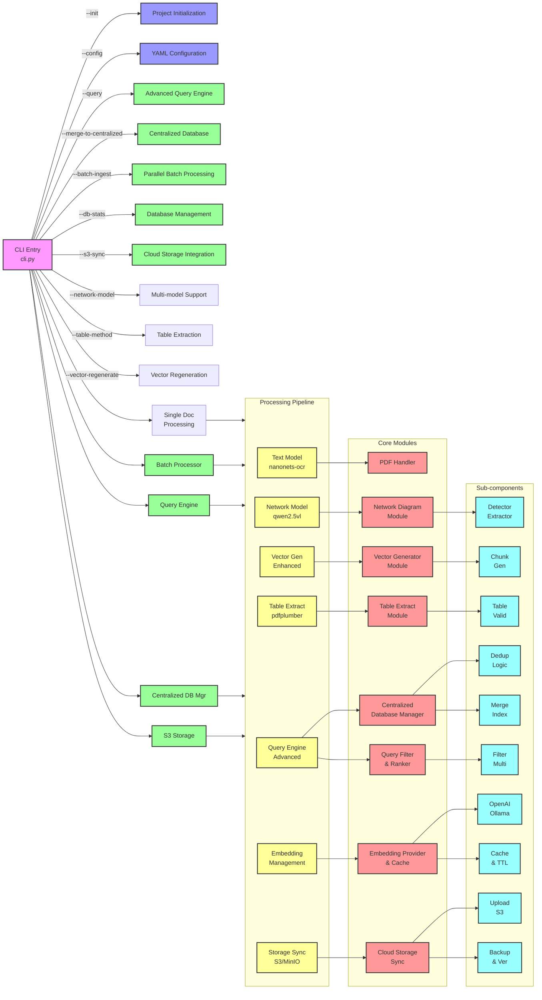

# NetIntel-OCR

**Transform Your Network Documentation into Intelligent, Searchable Knowledge**

NetIntel-OCR is an enterprise-grade document intelligence platform that automatically extracts network diagrams, tables, and text from PDF documents, creating structured, searchable knowledge bases using advanced AI models.

## 🚀 Key Features

- **Intelligent Extraction**: Automatically detects and extracts network diagrams, converting them to Mermaid format
- **Multi-Model AI**: Leverages specialized models for text, vision, and embedding tasks
- **Vector Search**: Built-in vector database for semantic search across all documents
- **Scalable Architecture**: From single laptop to enterprise Kubernetes deployments
- **100% On-Premise**: Complete data sovereignty with local processing
- **Batch Processing**: Process thousands of documents in parallel
- **Smart Caching**: Checkpoint/resume support for long documents

## 📚 Documentation

- **[Quick Reference Guide](./Quick-Reference-Guide.md)** - Common commands and quick tips
- **[Deployment Guide](./Deployment-Guide.md)** - Installation and deployment options
- **[Architecture Guide](./Architecture-Guide.md)** - System design and components
- **[Use Cases](./UseCases.md)** - Real-world applications and ROI

## ⚡ Quick Start

### 5-Minute Setup

```bash
# Install NetIntel-OCR
pip install netintel-ocr

# Install Ollama (AI model server)
curl -fsSL https://ollama.com/install.sh | sh
ollama serve

# Pull required models
ollama pull nanonets-ocr-s:latest
ollama pull qwen2.5vl:latest

# Process your first PDF
netintel-ocr document.pdf
```

### Docker Setup

```bash
# Initialize with Docker support
netintel-ocr --init --deployment-scale minimal

# Start services
cd netintel-ocr/docker
docker-compose -f docker-compose.minimal.yml up

# Process documents
netintel-ocr /path/to/document.pdf
```

## 🎯 Use Cases

### Network Operations Centers (NOCs)
- Process thousands of network diagrams and documentation
- Build searchable knowledge bases for troubleshooting
- 70% reduction in incident resolution time

### Managed Security Service Providers (MSSPs)
- Extract security architectures from client documentation
- Automate compliance mapping
- 60% faster client onboarding

### Enterprise IT Departments
- Build intelligent CMDBs from existing documentation
- Automate documentation updates
- Enable semantic search across all IT assets

[See more use cases →](./UseCases.md)

## 🏗️ Architecture

NetIntel-OCR uses a modular, microservices architecture that scales from single containers to distributed Kubernetes deployments:

### System Component Diagram



[Learn more about the architecture →](./Architecture-Guide.md)

## 📊 Deployment Options

Choose the deployment that fits your needs:

| Scale | Users | Documents/Day | Setup Time | Resources |
|-------|-------|---------------|------------|-----------|
| **Minimal** | 1-5 | <10 | 5 min | 2GB RAM |
| **Small** | 5-20 | 10-50 | 15 min | 4GB RAM |
| **Medium** | 20-100 | 50-200 | 30 min | 8GB RAM |
| **Enterprise** | 100+ | 200+ | 1 hour | 16GB+ RAM |

[View deployment guide →](./Deployment-Guide.md)

## 💡 Key Capabilities

### Document Processing
- **Hybrid Mode**: Automatic detection of text and diagrams
- **Text-Only Mode**: Fast extraction for documents without diagrams
- **Network-Only Mode**: Focus on network diagram extraction
- **Table Extraction**: Complex table detection and structured output

### Search & Query
- **Vector Search**: Semantic search using embeddings
- **Advanced Filtering**: Multi-field queries with conditions
- **Result Reranking**: Intelligent relevance scoring
- **Multiple Formats**: JSON, Markdown, CSV output

### Enterprise Features
- **Batch Processing**: Parallel processing with 1-16 workers
- **Checkpoint/Resume**: Never lose progress on long documents
- **Cloud Storage**: S3/MinIO integration
- **API & MCP Servers**: REST API and LLM integration
- **Monitoring**: Prometheus metrics and Grafana dashboards

## 🔧 Common Commands

```bash
# Process a single document
netintel-ocr document.pdf

# Batch process multiple documents
netintel-ocr --batch-ingest --input-pattern "*.pdf" --parallel 8

# Search processed documents
netintel-ocr --query "firewall configuration"

# Export results
netintel-ocr --query "network topology" --output-format markdown > results.md

# Start API server
netintel-ocr --api --embedded-workers
```

[See all commands →](./Quick-Reference-Guide.md)

## 📈 Performance & ROI

### Processing Speed
- **Text-only**: 4-6 pages/minute
- **Standard**: 1-2 pages/minute
- **High accuracy**: 0.5-1 page/minute

### ROI Metrics
- **70% reduction** in documentation search time
- **60% faster** incident resolution
- **5x faster** compliance audits
- **$500K+ annual savings** for typical enterprise

[View detailed ROI analysis →](./UseCases.md#roi--benefits)

## 🔒 Security & Compliance

- **100% On-Premise**: No data leaves your infrastructure
- **Air-Gap Ready**: Deployable in isolated environments
- **Audit Trails**: Complete logging of all operations
- **Encryption**: At-rest and in-transit encryption
- **RBAC**: Role-based access control (Enterprise)

## 🛠️ System Requirements

### Minimum Requirements
- **OS**: Linux, macOS, or Windows (WSL2)
- **Python**: 3.9+
- **RAM**: 2GB
- **Storage**: 10GB

### Recommended
- **OS**: Ubuntu 22.04 LTS
- **RAM**: 8GB+
- **Storage**: 50GB SSD
- **GPU**: Optional (speeds up processing)

## 🤝 Support & Community

- **Documentation**: Comprehensive guides and references
- **GitHub Issues**: Bug reports and feature requests
- **Community**: Discord/Slack channels
- **Commercial Support**: enterprise@netintel-ocr.com

## 📜 License

NetIntel-OCR is available under the [Apache 2.0 License](./LICENSE.md).

## 🚀 Getting Started

1. **Choose your deployment scale** - See [Deployment Guide](./Deployment-Guide.md)
2. **Install and configure** - Follow the Quick Start above
3. **Process your first documents** - Start with a small batch
4. **Build your knowledge base** - Scale up as needed
5. **Enable advanced features** - Add search, API access, monitoring

---

**Ready to transform your network documentation?**

Start with our [Quick Reference Guide](./Quick-Reference-Guide.md) or dive into [real-world use cases](./UseCases.md) to see how NetIntel-OCR can revolutionize your document intelligence capabilities.