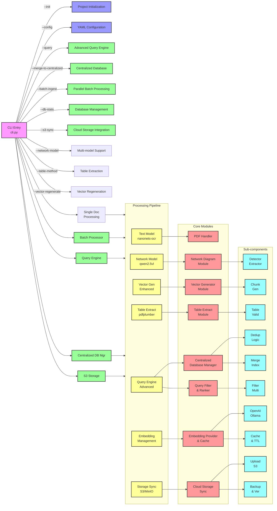

# NetIntel-OCR

**Intelligent Document Processing for Network Infrastructure - Your First Step Toward Semantic CMDB**

NetIntel-OCR extracts and structures network documentation, converting PDFs into searchable knowledge with network diagrams in Mermaid format, structured tables, and vector embeddings. While today it delivers powerful document intelligence, it's designed as the essential foundation for tomorrow's Semantic CMDBs - where network relationships become queryable knowledge graphs.

## 🚀 Current Capabilities

- **Network Diagram Extraction**: Converts visual network diagrams to structured Mermaid.js format
- **Intelligent Text Processing**: Extracts and structures text content using AI models
- **Table Detection**: Identifies and extracts configuration tables as structured JSON
- **Vector Search**: Creates searchable embeddings stored in LanceDB for semantic search
- **Batch Processing**: Parallel processing of multiple PDFs with checkpoint/resume
- **100% On-Premise**: Complete local processing with Ollama models
- **API & MCP Servers**: REST API and Model Context Protocol for integrations

## 🎯 Future Vision: Semantic CMDB

NetIntel-OCR is architected to evolve into a complete Semantic CMDB solution:
- **RDF Triple Generation** (Roadmap): Transform extracted relationships into RDF format
- **Knowledge Graph Construction** (Roadmap): Build queryable semantic models
- **SPARQL Queries** (Roadmap): Enable complex relationship queries
- **Impact Analysis** (Roadmap): Understand cascading effects automatically

## 📚 Documentation

- **[Quick Reference Guide](./Quick-Reference-Guide.md)** - Common commands and quick tips
- **[Deployment Guide](./Deployment-Guide.md)** - Installation and deployment options
- **[Architecture Guide](./Architecture-Guide.md)** - System design and components
- **[Use Cases](./UseCases.md)** - Real-world applications and ROI

## ⚡ Quick Start

Documentation hosted on https://visionml.net/docs/

### 5-Minute Setup

```bash
# Install NetIntel-OCR
pip install netintel-ocr

# Install Ollama (AI model server)
curl -fsSL https://ollama.com/install.sh | sh
ollama serve

# Pull required models
ollama pull nanonets-ocr-s:latest
ollama pull qwen2.5vl:latest

# Process your first PDF
export OLLAMA_HOST=http://ip.add.ress:11434
netintel-ocr --model nanonets-ocr-s:latest --network-model qwen2.5vl:latest --debug document.pdf
```

### Docker Setup

```bash
# Initialize with Docker support
netintel-ocr --init --deployment-scale minimal

# Start services
cd netintel-ocr/docker
docker-compose -f docker-compose.minimal.yml up

# Process documents
netintel-ocr /path/to/document.pdf
```

## 🎯 What NetIntel-OCR Does Today

### Current Document Processing
- **Extracts** network diagrams as Mermaid.js for visualization and documentation
- **Identifies** tables and configurations, converting them to structured JSON
- **Creates** searchable vector embeddings for semantic document search
- **Processes** batches of PDFs in parallel with enterprise-scale performance

### Immediate Benefits
- **70% faster** documentation search with vector similarity
- **Automated** network diagram extraction saves hours of manual work
- **Structured** output ready for integration with existing tools
- **Local** processing ensures complete data security

## 🚀 The Path Ahead: From Documents to Semantic CMDB

### Phase 1: Today - Document Intelligence
✅ Extract network diagrams to Mermaid format
✅ Structure tables and configurations
✅ Create searchable vector database
✅ Enable batch processing at scale

### Phase 2: Next - Relationship Mapping (Roadmap)
🔄 Identify entities and their connections
🔄 Generate RDF triples from diagrams
🔄 Build initial knowledge graphs
🔄 Enable basic relationship queries

### Phase 3: Future - Full Semantic CMDB
📅 SPARQL query interface
📅 Automated impact analysis
📅 Predictive failure detection
📅 Self-updating knowledge graphs

[Learn about the vision →](./UseCases.md)

## 🏗️ Architecture

NetIntel-OCR uses a modular, microservices architecture that scales from single containers to distributed Kubernetes deployments:

### System Component Diagram



[Learn more about the architecture →](./Architecture-Guide.md)

## 📊 Deployment Options

Choose the deployment that fits your needs:

| Scale | Users | Documents/Day | Setup Time | Resources |
|-------|-------|---------------|------------|-----------|
| **Minimal** | 1-5 | <10 | 5 min | 2GB RAM |
| **Small** | 5-20 | 10-50 | 15 min | 4GB RAM |
| **Medium** | 20-100 | 50-200 | 30 min | 8GB RAM |
| **Enterprise** | 100+ | 200+ | 1 hour | 16GB+ RAM |

[View deployment guide →](./Deployment-Guide.md)

## 💡 Current Features in Detail

### Network Diagram Processing
- **Visual to Structured**: Converts network diagrams to Mermaid.js format
- **Component Detection**: Identifies routers, switches, firewalls in diagrams
- **Connection Mapping**: Preserves network topology in structured format
- **Multi-Diagram Support**: Handles multiple diagrams per document

### Document Intelligence
- **Table Extraction**: Detects and structures configuration tables
- **Text Processing**: AI-powered extraction with Ollama models
- **Vector Embeddings**: Creates semantic search capabilities via LanceDB
- **Metadata Preservation**: Maintains document context and properties

### Enterprise Features
- **Batch Processing**: Parallel processing with 1-16 workers
- **Checkpoint/Resume**: Never lose progress on large documents
- **API Integration**: REST API for programmatic access
- **Cloud Storage**: S3/MinIO support for scalability

## 🔧 Available Commands Today

```bash
# Current Capabilities:

# Extract network diagrams and text from PDF
netintel-ocr network-architecture.pdf

# Process multiple documents with parallel workers
netintel-ocr --batch-ingest --input-pattern "*.pdf" --parallel 8

# Search using vector similarity
netintel-ocr --query "router configuration"

# Export extracted diagrams as Mermaid
cat output/*/markdown/document.md

# Start API server for integrations
netintel-ocr --api --embedded-workers

# Future Capabilities (Roadmap):
# netintel-ocr --generate-rdf        # Coming: RDF triple generation
# netintel-ocr --semantic-query      # Coming: SPARQL queries
# netintel-ocr --impact-analysis     # Coming: Dependency analysis
```

[See all current commands →](./Quick-Reference-Guide.md)

## 📈 Value Today & Tomorrow

### What You Get Today
- **Mermaid Diagrams**: Network topology in reusable format
- **Structured Tables**: Configuration data as JSON
- **Vector Search**: Find related documents instantly
- **Batch Processing**: Handle thousands of PDFs efficiently

### Current ROI
- **70% faster** document search with vector embeddings
- **Hours saved** on manual diagram recreation
- **100% local** processing for security compliance
- **Structured output** for tool integration

### The Semantic CMDB Vision
| Today's NetIntel-OCR | Tomorrow's Semantic CMDB |
|---------------------|-------------------------|
| Extract diagrams to Mermaid | Generate RDF relationships |
| Vector search documents | SPARQL query relationships |
| Find similar content | Understand dependencies |
| Structure information | Predict impacts |

[Explore the complete vision →](./UseCases.md)

## 🔒 Security & Compliance

- **100% On-Premise**: No data leaves your infrastructure
- **Air-Gap Ready**: Deployable in isolated environments
- **Audit Trails**: Complete logging of all operations
- **Encryption**: At-rest and in-transit encryption
- **RBAC**: Role-based access control (Enterprise)

## 🛠️ System Requirements

### Minimum Requirements
- **OS**: Linux, macOS, or Windows (WSL2)
- **Python**: 3.9+
- **RAM**: 2GB
- **Storage**: 10GB

### Recommended
- **OS**: Ubuntu 22.04 LTS
- **RAM**: 8GB+
- **Storage**: 50GB SSD
- **GPU**: Optional (speeds up processing)

## 🤝 Support & Community

- **Documentation**: Comprehensive guides and references
- **GitHub Issues**: Bug reports and feature requests
- **Community**: Discord/Slack channels
- **Commercial Support**: enterprise@netintel-ocr.com

## 📜 License

NetIntel-OCR is available under the [Apache 2.0 License](./LICENSE.md).

## 🚀 Getting Started with NetIntel-OCR

### Start Extracting Value Today
1. **Deploy NetIntel-OCR** - Follow the [Deployment Guide](./Deployment-Guide.md)
2. **Process your PDFs** - Extract diagrams, tables, and text
3. **Search your knowledge** - Use vector search for instant access
4. **Integrate via API** - Connect with existing tools

### Your Roadmap to Semantic CMDB

#### ✅ Phase 1: Current - Document Intelligence
- Extract network diagrams as Mermaid.js
- Structure tables and configurations
- Build searchable vector database
- Enable enterprise-scale processing

#### 🔄 Phase 2: Coming Soon - Relationship Mapping
- Entity and connection identification
- RDF triple generation from diagrams
- Initial knowledge graph construction
- Basic relationship queries

#### 📅 Phase 3: Future - Full Semantic CMDB
- SPARQL query interface
- Automated impact analysis
- Predictive failure detection
- Self-updating knowledge graphs

---

**Start your journey today with powerful document extraction.**

NetIntel-OCR delivers immediate value through intelligent document processing while laying the groundwork for tomorrow's Semantic CMDB. Extract network diagrams, structure configurations, and build searchable knowledge bases today - then evolve into relationship mapping and semantic intelligence as the platform grows.

Get started with our [Quick Reference Guide](./Quick-Reference-Guide.md) or learn about [the Semantic CMDB vision](./UseCases.md).
