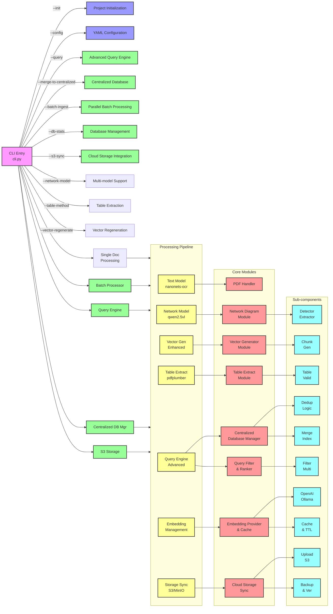

# NetIntel-OCR Architecture Overview

## Overview

NetIntel-OCR is a specialized Python-based tool that intelligently processes PDF documents, automatically detecting and converting network diagrams into Mermaid.js format while preserving text content. It uses multimodal AI models via Ollama to process PDFs by converting pages to images and then using vision-language models to transcribe content and identify network-specific diagrams for enhanced extraction. 

The system delivers the complete centralized database architecture with advanced query engine, parallel batch processing, S3/MinIO cloud storage integration, and comprehensive embedding management system.

## System Architecture

### Component Diagram

