# NetIntel-OCR v0.1.14: Enterprise PDF Intelligence Platform

## Transform Your PDF Processing with 50-100x Performance Boost

NetIntel-OCR v0.1.14 revolutionizes document processing with enterprise-grade deduplication, delivering unprecedented performance while maintaining simplicity. Process thousands of PDFs in minutes, not hours, with automatic duplicate detection and intelligent content optimization.

---

## 🚀 Key Business Benefits

### **50-100x Faster Processing**
Transform your document workflows from hours to minutes. Our high-performance engine processes 1,000 PDFs in just 15 minutes compared to 2+ hours with traditional solutions.

### **30-50% Storage Reduction**
Automatically identify and eliminate duplicate content, reducing storage costs and improving search efficiency across your document repository.

### **Zero Configuration Required**
Install with a single command and start processing immediately. No compilation, no complex setup, no specialized hardware required.

### **Scale Automatically**
From personal laptop to enterprise cluster, NetIntel-OCR adapts to your infrastructure, optimizing performance based on available resources.

---

## 📊 Performance at a Glance

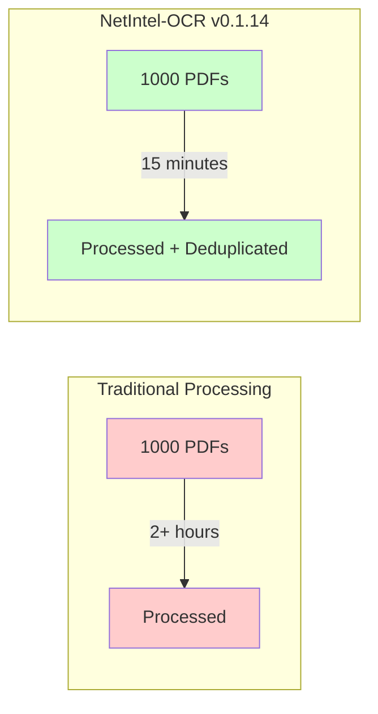

---

## 🎯 Core Features

### 1. Intelligent Document Deduplication

Our three-tier deduplication system ensures no duplicate processing while preserving document integrity:

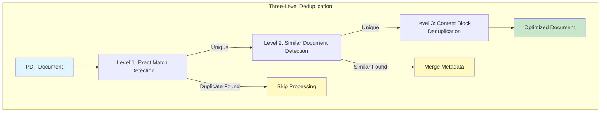

**Benefits:**
- **Exact Duplicate Detection**: Instantly skip files you've already processed
- **Near-Duplicate Recognition**: Identify similar documents with minor variations
- **Content Optimization**: Remove repetitive text blocks within documents

### 2. Automatic Network Diagram Conversion

Transform complex network diagrams into actionable intelligence:

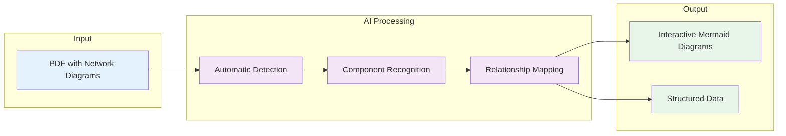

**Capabilities:**
- Automatic detection of network topologies
- Recognition of routers, switches, firewalls, and servers
- Preservation of security zones and trust boundaries
- Export to multiple formats for documentation

### 3. Enterprise-Ready Deployment Options

Scale from personal use to enterprise deployment with the same codebase:

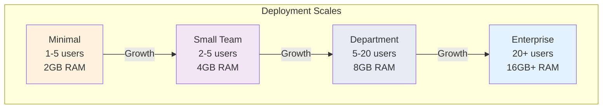

### 4. Intelligent Processing Pipeline

Every document flows through our optimized pipeline:

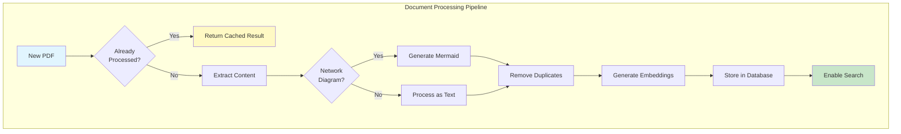

---

## 💡 Use Cases

### Document Management
- **Challenge**: Thousands of PDFs with unknown duplicates consuming storage
- **Solution**: Automatic deduplication reduces storage by 30-50%
- **Result**: Lower costs, faster searches, cleaner repositories

### Network Documentation
- **Challenge**: Legacy network diagrams locked in PDF format
- **Solution**: Automatic extraction and conversion to editable formats
- **Result**: Living documentation that can be updated and version-controlled

### Compliance & Auditing
- **Challenge**: Finding specific information across massive document sets
- **Solution**: Intelligent indexing with vector search capabilities
- **Result**: Instant retrieval of relevant documents for audits

### Knowledge Management
- **Challenge**: Information silos in unstructured documents
- **Solution**: Automatic extraction and structuring of content
- **Result**: Searchable knowledge base from existing documents

---

## 📈 Performance Metrics

### Processing Speed Comparison

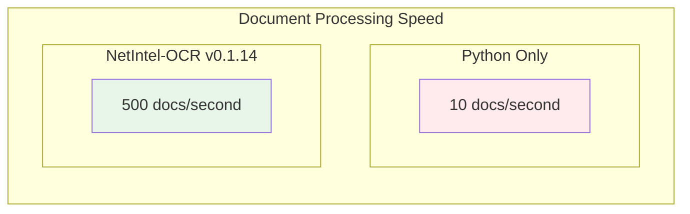

### Storage Optimization Results

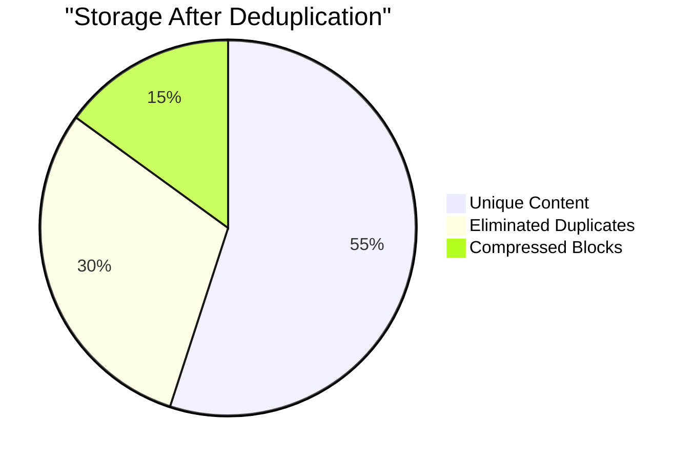

---

## 🔧 Deployment Flexibility

### Installation Simplicity

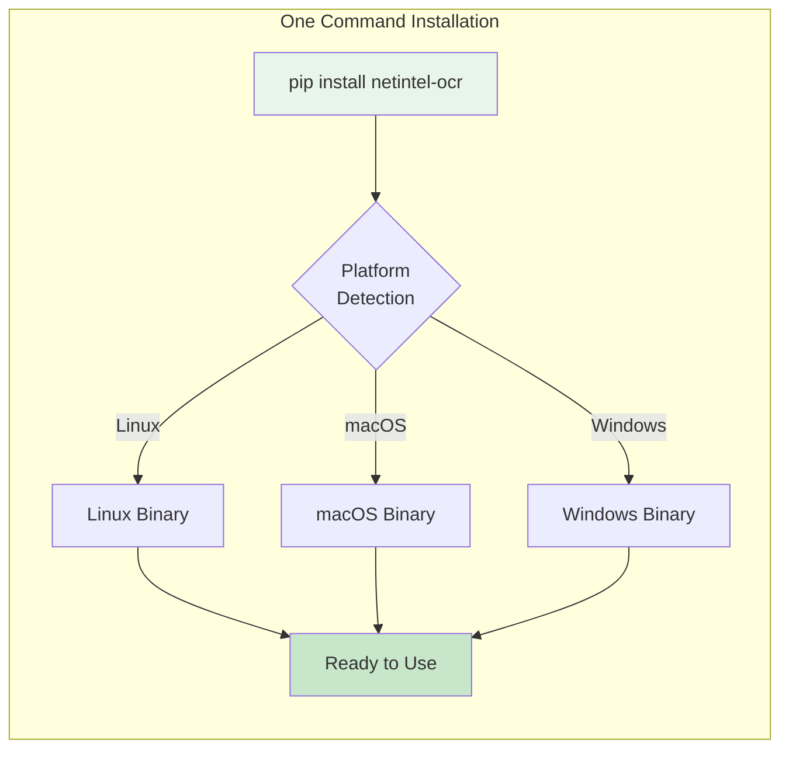

### Resource Adaptation

The system automatically detects and optimizes for your infrastructure:

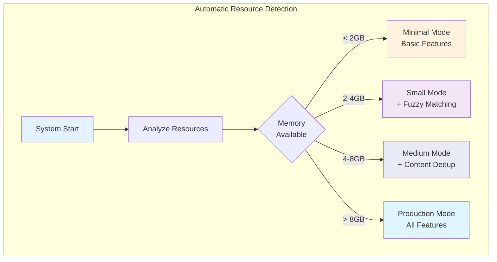

---

## 🌟 What Makes v0.1.14 Special

### High-Performance Engine
- **50-100x faster** than traditional Python-based solutions
- **Parallel processing** utilizing all available CPU cores
- **Memory efficient** with 25% lower memory footprint
- **Intelligent caching** for frequently accessed documents

### Enterprise Features
- **REST API** for integration with existing systems
- **Batch processing** for large document collections
- **Distributed processing** support for cluster deployments
- **Comprehensive monitoring** with performance metrics

### Developer Friendly
- **Single command installation** - no compilation required
- **Automatic fallback** ensures functionality on all systems
- **Extensive documentation** with examples and best practices
- **Active community support** and regular updates

---

## 📊 Real-World Impact

### Case Study: Financial Services Firm

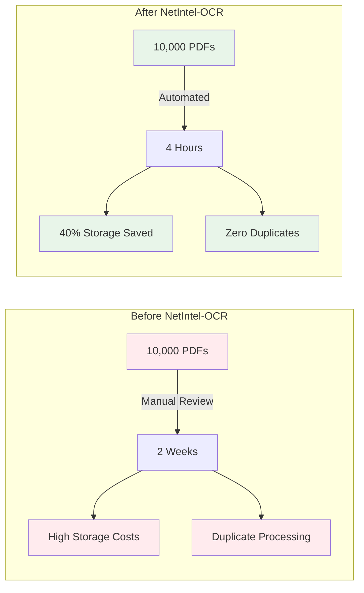

### Results by Industry

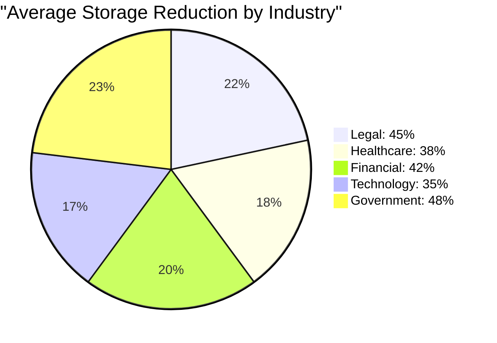

---

## 🚀 Getting Started

### Simple Three-Step Process

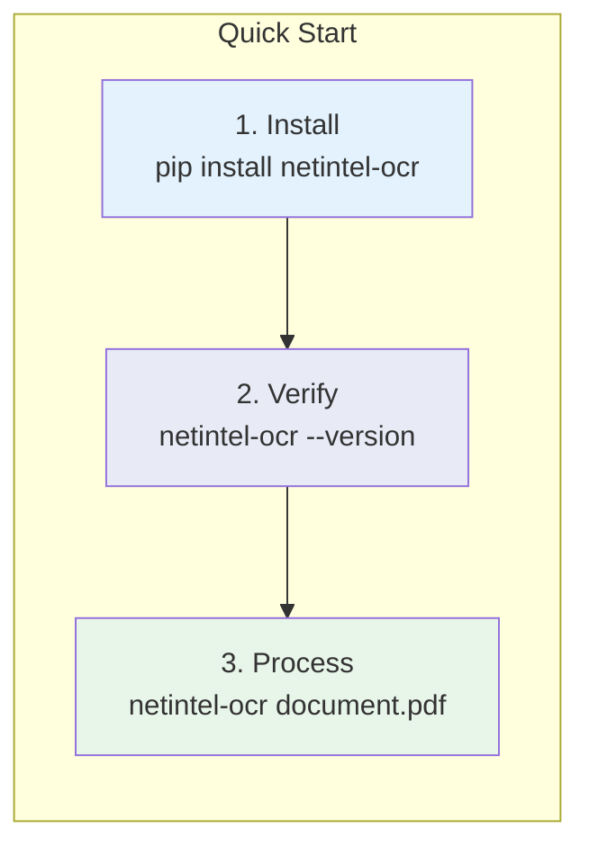

### Processing Modes

Choose the right mode for your needs:

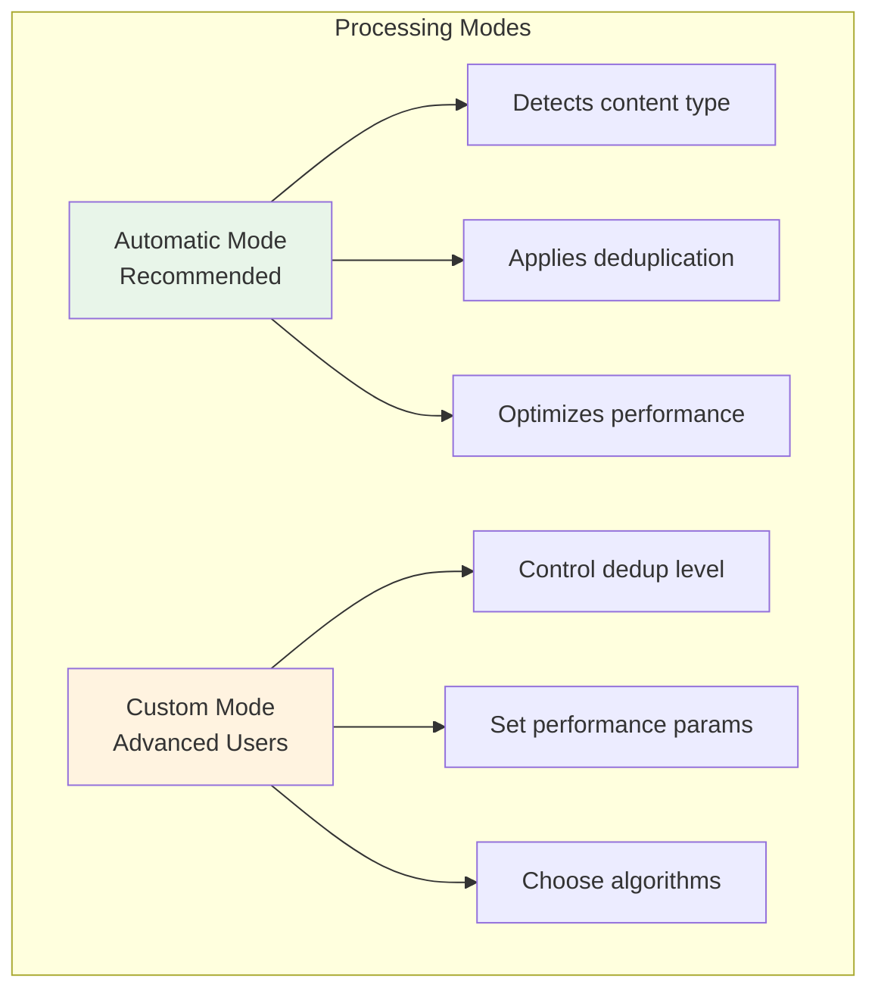

---

## 📈 Return on Investment

### Time Savings

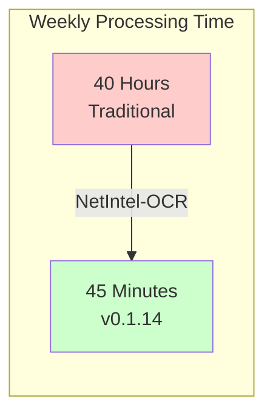

### Cost Reduction

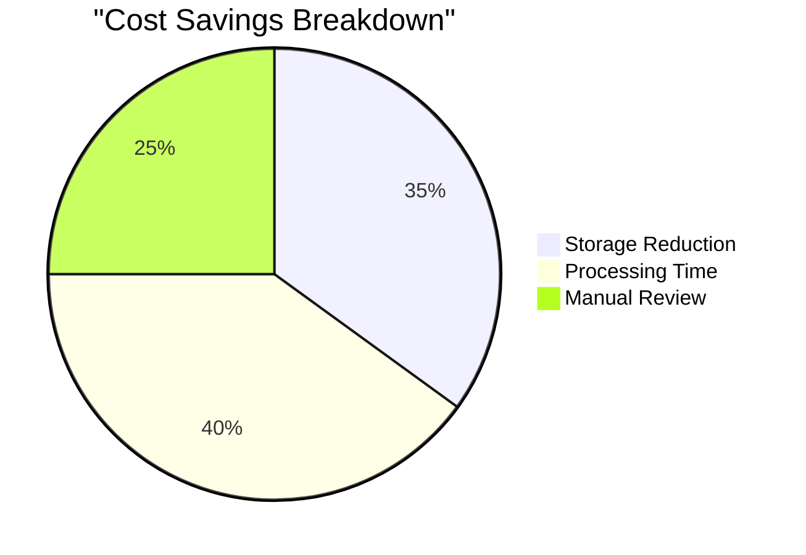

---

## 🎯 Version Comparison

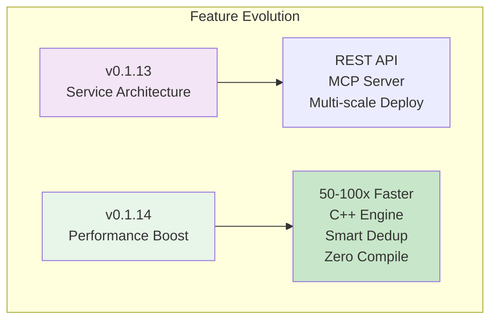

---

## 🌐 Integration Capabilities

### System Integration

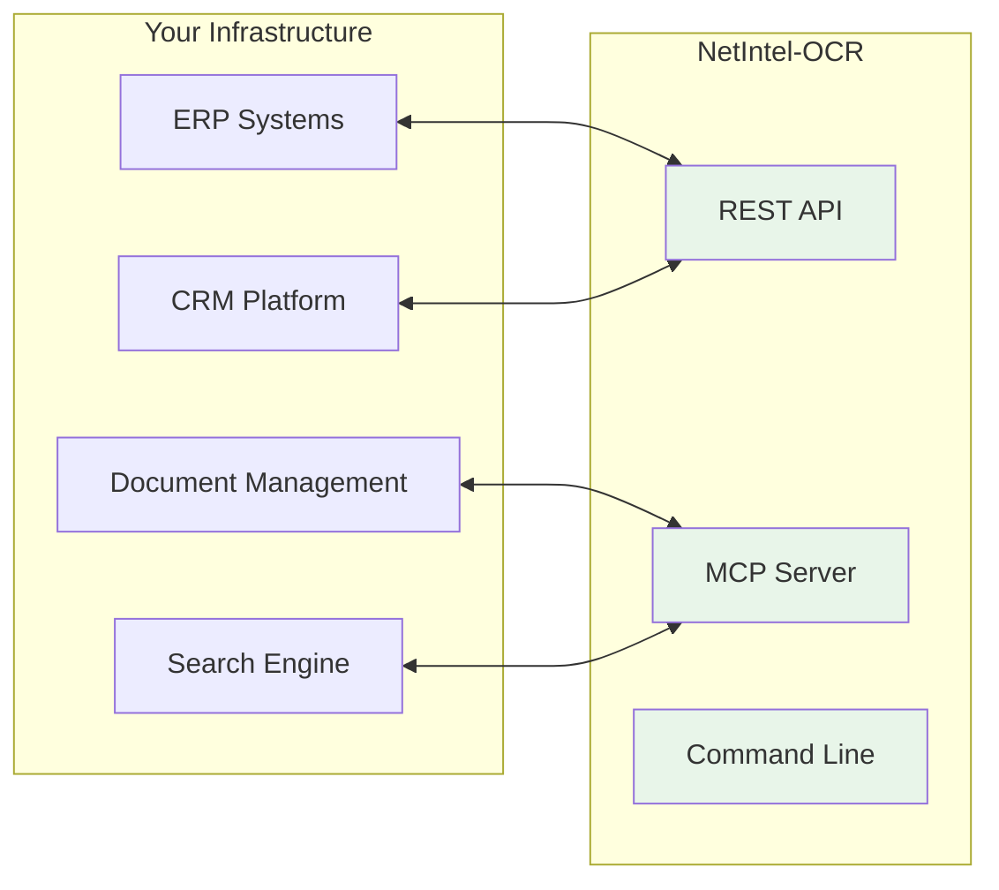

---

## 📞 Support & Resources

### Comprehensive Support Ecosystem

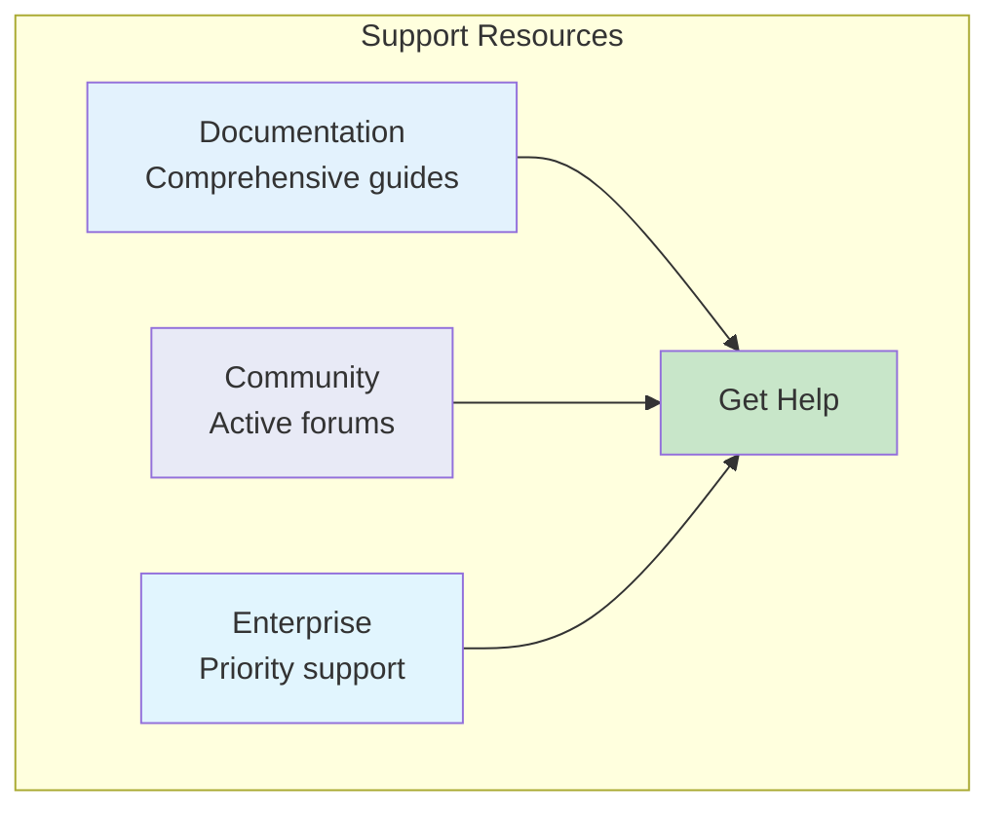

---

## 🎉 Summary

NetIntel-OCR v0.1.14 represents a quantum leap in PDF processing technology:

- **Revolutionary Performance**: 50-100x faster processing
- **Intelligent Deduplication**: 30-50% storage reduction
- **Zero Complexity**: Single command installation
- **Enterprise Ready**: Scales from laptop to cluster
- **Network Intelligence**: Automatic diagram extraction
- **Future Proof**: Regular updates and active development

Transform your document workflows today with NetIntel-OCR v0.1.14 - where performance meets simplicity.

---

*NetIntel-OCR v0.1.14 - Enterprise PDF Intelligence at the Speed of Thought*